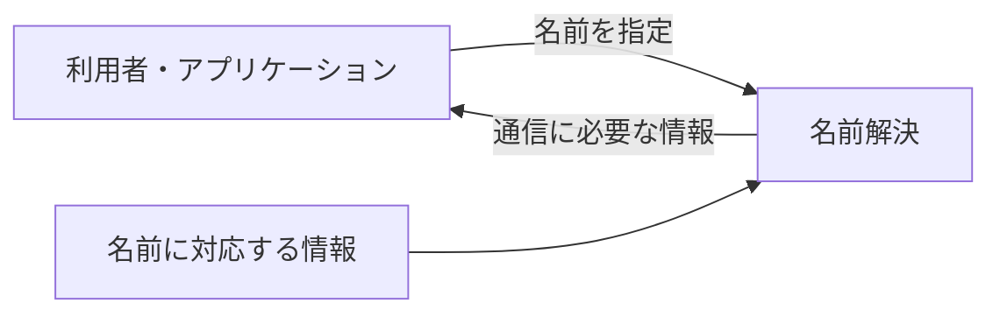

# 準備章 なぜ名前解決が必要なのか

> この章は、第2章以降を読むための最小限の前提を説明します。DNSの通信手順や設定方法は扱いません。

DNSを「覚えにくいIPアドレスの代わりに、覚えやすい名前を使う仕組み」と説明することがあります。これは利点の一つですが、それだけでは、利用者がURLを覚えずにブックマークやリンクを使う現在にも名前解決が必要な理由を説明できません。

この章では、まず「名前と通信に必要な情報を分けること」と「分けた情報を利用時に結び付けること」を説明します。その後で、その対応情報の管理を複数の範囲へ分けたDNSの設計を区別します。いずれも何かを「分ける」話ですが、分ける対象と解く問題は同じではありません。

歴史については三つの時代を区別します。DNS以前にも、ホスト名とアドレスの対応を調べる仕組みはありました。1983年に提案され、1987年に現在の骨格が定まったDNSは、その対応情報を大規模に管理し、参照する方法を変えました。その後、同じ仕組みの上へ負荷分散や障害時の切り替えなどの用途が加わりました。後から普及した用途を、最初からの目的だったかのようには扱いません。

## 1. 名前と通信に必要な情報は役割が違う

ネットワーク上の相手と通信するには、通信を届けるための情報が必要です。一方、人やアプリケーションは、相手を継続して参照するための識別子を必要とします。この二つは同じ役割ではありません。

数値のアドレスを相手の識別子として直接記録することもできます。しかし、相手のアドレスが変わるたびに、利用者の記録やアプリケーションの設定も直さなければなりません。人にとって覚えやすいかどうかだけでなく、**何を利用したいか**と、**現在どこへ通信を届けるか**が一つの値へ固定されることが問題です。

そこで、人やアプリケーションが参照する名前と、通信に必要な情報を別の値にします。ここで分けるのは、**識別する値**と**その時点の通信先を示す値**の役割です。まだ、ドメインを細かく区切ることや、管理する組織を分けることを指してはいません。

名前を使う側は名前を保持し、その名前に現在対応する情報を別に管理します。名前に対応する情報を後から変更できれば、名前を使う側の記録をすべて同時に書き換えずに済みます。ただし、変更済みの情報がいつ利用者から見えるかは、キャッシュなどにも左右されます。変更が即座に全利用者へ届くという意味ではありません。

この図では、名前を使う側と、名前に対応する情報を管理する側を分けています。どのサーバーへどの順序で問い合わせるかは省略しています。

## 2. 名前解決は分けた値を利用時に結び付ける

本書では、**名前解決**を、名前について、通信やサービスの利用に必要な情報を得る処理と呼びます。「名前をIPアドレスへ変換する処理」は代表例ですが、DNSが扱う情報はIPアドレスだけではありません。

なお、URLとドメイン名を同じものとはみなしません。1994年のRFC 1738が定めたURLは、アクセス方法やホストなどを含み、ホスト名はその一部として現れます。一方、次節で扱うホスト名の資料は1973年のものです。したがって、DNSを「URLを覚えやすくするために作られた仕組み」とは説明できません。[RFC 1738: Uniform Resource Locators (URL)](https://www.rfc-editor.org/rfc/rfc1738.html)

## 3. DNS以前にも名前解決はあった

DNSが名前解決そのものを発明したわけではありません。1973年のRFC 606は、公式のホスト名一覧がすでに存在し、各サイトが名前とアドレスの表を自分のシステムやプログラムのために維持していたと記録しています。問題は、ネットワークから機械可読な一覧を取得できず、確認された各サイトの表が互いに食い違い、完全な表がなかったことでした。[RFC 606: Host Names On-line](https://www.rfc-editor.org/rfc/rfc606.html)

1974年のRFC 608では、Network Information Center（NIC）が一つの機械可読な一覧を生成し、各サイトが取得できるようにする案が示されました。集中管理は、名前解決を初めて可能にするためではなく、別々に維持された表の不一致と重複作業を減らすために選ばれたのです。[RFC 608: Host Names On-Line](https://www.rfc-editor.org/rfc/rfc608.html)

ここまでで、三つの段階を分けて考えられます。

1. **値の役割を分ける**――継続して参照する名前と、その時点で通信に必要な情報を別の値にする
2. **分けた値を結び付ける**――名前を使う時点で、対応する情報を得る
3. **対応情報の管理を分担する**――誰がどの範囲を正しい状態に保ち、利用者がどこから参照できるようにするかを決める

名前解決が直接行うのは二つ目の処理です。一つ目は、その処理を必要にする値の設計です。対応表を一つ作れば二つ目は実現できますが、利用者と更新主体が増えても三つ目を続けられるとは限りません。

## 4. DNSが最初に変えようとしたもの

一つの基準となるホスト表は、サイトごとの食い違いを減らしました。その代わり、名前を使う前の登録、マスターの更新、一覧の配布が中央へ集まりました。ホストと更新する組織が増えると、表の大きさだけでなく、変更の調整と新版の配布も増えます。

1983年のRFC 882は、従来のホスト表について、大きさと更新頻度が管理可能な限界に近づいていると説明しました。1987年のRFC 1034は、ホスト数に応じてマスター表の更新、配布の負荷、組織間の調整が増えることを、新しい仕組みが必要になった背景として整理しています。[RFC 882: Domain Names—Concepts and Facilities](https://www.rfc-editor.org/rfc/rfc882.html) [RFC 1034: Domain Names—Concepts and Facilities](https://www.rfc-editor.org/rfc/rfc1034.html#section-2.1)

DNSがこの段階で中心的に解こうとしたのは、名前を人に覚えさせる問題でも、名前とアドレスを初めて別の値にすることでもありません。前節の三つ目、すなわち**名前に対応する情報を、一つの組織と一つの一覧へ集めずに管理し、必要な情報を参照できるようにすること**でした。

そのために、名前空間を階層化し、範囲ごとに管理責任を委ねる設計が採用されました。ここで初めて、名前空間と管理責任を範囲に分ける話が現れます。第1節の「二種類の値を分ける」と、この「管理する範囲を分ける」を同じ分離だと捉えないことが重要です。具体的に何を境界として分けるのかは、第2章で扱います。

## 5. 最初の目的と、後から広がった用途を分ける

名前とアドレスを別に管理すれば、同じ名前に対応するアドレスを変更したり、複数のアドレスを対応させたりできます。この性質は、サーバーの移転、複数サーバーへの負荷の分散、障害時の接続先変更にも利用できます。

ただし、それらをDNS誕生時の中心目的とみなすと、時代を混同します。本書の見取り図では、ドメイン名の最初の仕様を1983年、現在の骨格を定めた仕様を1987年、DNSを使った負荷分散の工夫を扱うRFC 1794を1995年に置いています。初期DNSの複数アドレス表現と、後に発展した負荷分散の運用も同じものではありません。[RFC 1794: DNS Support for Load Balancing](https://www.rfc-editor.org/rfc/rfc1794.html)

また、DNSの応答を変更するだけで、瞬時で確実な切り替えが成立するわけではありません。以前の応答がキャッシュに残る時間、障害を検出して情報を変更する外部の仕組み、複数の候補から接続先を選ぶ側の動作が関係します。負荷分散の運用と拡張は第8章と第9章、障害時の切り替えは第4章、変更が見えるまでの時間は第5章で、それぞれの要件から評価します。

このように時代と目的を分けると、名前解決が必要な理由は次のように整理できます。

- 名前を使う側と、その時点で通信に必要な情報を分けるため
- 名前に対応する情報を、利用時に得られるようにするため
- DNSではさらに、その対応情報の管理と参照を、一つの一覧へ集中させずに続けるため

## この章の言い換え

| 前 | 後 |
| --- | --- |
| 「DNSはIPアドレスを覚えなくて済むようにする」 | 「人やアプリケーションが保持する名前と、その時点で通信に必要な情報を分ける」 |
| 「DNSはURLを覚えやすくするために作られた」 | 「Webより前からあった名前解決の情報を、分散して管理・参照できるようにした」 |
| 「DNSは負荷分散のために作られた」 | 「分散管理を目的とした初期設計の性質が、後に負荷分散や切り替えにも利用された」 |

## 参照資料

- [RFC 606: Host Names On-line](https://www.rfc-editor.org/rfc/rfc606.html)
- [RFC 608: Host Names On-Line](https://www.rfc-editor.org/rfc/rfc608.html)
- [RFC 1738: Uniform Resource Locators (URL)](https://www.rfc-editor.org/rfc/rfc1738.html)
- [RFC 882: Domain Names—Concepts and Facilities](https://www.rfc-editor.org/rfc/rfc882.html)
- [RFC 1034: Domain Names—Concepts and Facilities](https://www.rfc-editor.org/rfc/rfc1034.html) 2.1節
- [RFC 1794: DNS Support for Load Balancing](https://www.rfc-editor.org/rfc/rfc1794.html)

---

[← 第1章 見取り図](01-timeline.md)｜[目次](../)｜[次の章 → 第2章 拡張性](02-scalability.md)


