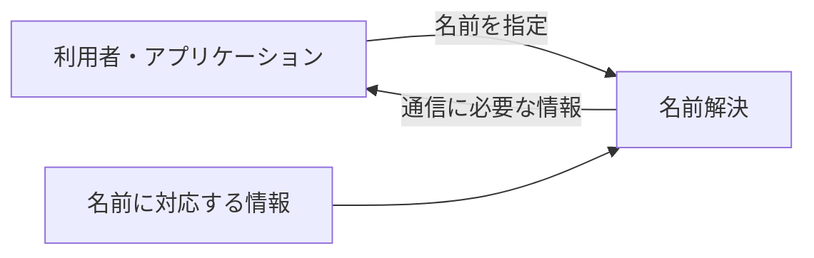

# 準備章 なぜ名前解決が必要なのか

> この章は、第2章以降を読むための最小限の前提を説明します。DNSの通信手順や設定方法は扱いません。

DNSを「覚えにくいIPアドレスの代わりに、覚えやすい名前を使う仕組み」と説明することがあります。これは利点の一つですが、それだけでは、利用者がURLを覚えずにブックマークやリンクを使う現在にも名前解決が必要な理由を説明できません。

この章では、まず「名前と通信に必要な情報を分けること」と「分けた情報を利用時に結び付けること」を説明します。その後で、その対応情報の管理を複数の範囲へ分けたDNSの設計を区別します。いずれも何かを「分ける」話ですが、分ける対象と解く問題は同じではありません。

## 1. 名前と通信に必要な情報は役割が違う

ネットワーク上の相手と通信するには、通信を届けるための情報が必要です。一方、人やアプリケーションは、相手を継続して参照するための識別子を必要とします。この二つは同じ役割ではありません。

数値のアドレスを相手の識別子として直接記録することもできます。しかし、相手のアドレスが変わるたびに、利用者の記録やアプリケーションの設定も直さなければなりません。人にとって覚えやすいかどうかだけでなく、**何を利用したいか**と、**現在どこへ通信を届けるか**が一つの値へ固定されることが問題です。

そこで、人やアプリケーションが参照する名前と、通信に必要な情報を別の値にします。ここで分けるのは、**識別する値**と**その時点の通信先を示す値**の役割です。まだ、ドメインを細かく区切ることや、管理する組織を分けることを指してはいません。

名前を使う側は名前を保持し、その名前に現在対応する情報を別に管理します。名前に対応する情報を後から変更できれば、名前を使う側の記録をすべて同時に書き換えずに済みます。ただし、変更済みの情報がいつ利用者から見えるかは、キャッシュなどにも左右されます。変更が即座に全利用者へ届くという意味ではありません。

これは間接参照を選ぶ理由についての本書の整理です。接続先が変わらず、利用者の設定を一括して直せる範囲なら、直接アドレスを持つ案も比較できます。名前を介する案は、利用側の変更を減らす代わりに、対応情報を取得・維持する依存先を増やします。名前自体の管理や継続利用が不要になるわけでもありません。

```mermaid
flowchart LR
  U["利用者・アプリケーション"] -->|"名前を指定"| R["名前解決"]
  D["名前に対応する情報"] --> R
  R -->|"通信に必要な情報"| U
```

この図では、名前を使う側と、名前に対応する情報を管理する側を分けています。どのサーバーへどの順序で問い合わせるかは省略しています。

## 2. 名前解決は分けた値を利用時に結び付ける

本書では、**名前解決**を、名前について、通信やサービスの利用に必要な情報を得る処理と呼びます。「名前をIPアドレスへ変換する処理」は代表例ですが、DNSが扱う情報はIPアドレスだけではありません。

なお、URLとドメイン名を同じものとはみなしません。歴史資料である1994年のRFC 1738の3.1節では、インターネット上のホストを使うURLに、方式やホストなどを含む構文を示しています。URLのすべてがホスト名を含むわけではなく、この公表年をURLの発明年ともみなしません。DNSの初期目的は年代差だけから推測せず、第4節のRFC 882が述べる名前とアドレスの管理上の問題から確認します。[RFC 1738: Uniform Resource Locators (URL) 3.1節](https://www.rfc-editor.org/rfc/rfc1738.html)

## 3. DNS以前にも名前解決はあった

DNSが名前解決そのものを発明したわけではありません。1973年のRFC 606には、各サイトが名前とアドレスの表を維持していたことが記録されています。対応表を参照することでも、名前から情報は得られます。問題は、別々に維持した表が食い違っていたことでした。表を一つの基準へ集め、その後に管理責任を分割する経緯は、[第2章](02-scalability.md)で評価します。[RFC 606: Host Names On-line](https://www.rfc-editor.org/rfc/rfc606.html)

ここまでで、三つの段階を分けて考えられます。

1. **値の役割を分ける**――継続して参照する名前と、その時点で通信に必要な情報を別の値にする
2. **分けた値を結び付ける**――名前を使う時点で、対応する情報を得る
3. **対応情報の管理を分担する**――誰がどの範囲を正しい状態に保ち、利用者がどこから参照できるようにするかを決める

名前解決が直接行うのは二つ目の処理です。一つ目は、その処理を必要にする値の設計です。対応表を一つ作れば二つ目は実現できますが、利用者と更新主体が増えても三つ目を続けられるとは限りません。

## 4. DNSが最初に変えようとしたもの

ホストと更新する組織が増えると、一つの表の維持と配布では負荷や調整が集中します。RFC 882とRFC 1034は、これを新しい仕組みが必要になった背景として挙げています。DNSが中心的に変えたのは、前節の三つ目、すなわち**対応情報を、一つの組織と一つの一覧へ集めずに管理し、参照する方法**です。[RFC 882: Domain Names—Concepts and Facilities](https://www.rfc-editor.org/rfc/rfc882.html)、[RFC 1034: Domain Names—Concepts and Facilities](https://www.rfc-editor.org/rfc/rfc1034.html#section-2.1)

そのために、名前空間を階層化し、範囲ごとに管理責任を委ねる設計が採用されました。ここで初めて、名前空間と管理責任を範囲に分ける話が現れます。第1節の「二種類の値を分ける」と、この「管理する範囲を分ける」は、分ける対象が異なります。

### 名前の範囲と管理する範囲

名前を階層として並べた全体を**名前空間**と呼びます。その中で、ある名前を根とする部分木が**ドメイン**です。たとえば `example.jp` ドメインには、`www.example.jp` も `api.dev.example.jp` も含まれます。

一方、権威情報を管理する単位が**ゾーン**です。`example.jp` の管理側が `dev.example.jp` 以下を別のゾーンへ任せると、名前の階層はそのままでも、管理する範囲に境界ができます。このように子ゾーンへ権威を渡し、親にその参照先を置くことを**委譲**と呼びます。`dev.example.jp` 以下は `example.jp` ドメインに含まれ続けますが、親ゾーンの管理範囲からは外れます。[RFC 1034: Domain Names—Concepts and Facilities](https://www.rfc-editor.org/rfc/rfc1034.html) 3.1節、4.2節

ここでいう**権威情報**は、そのゾーンの責任のもとで提供される情報です。それを保持して問い合わせに答えるのが**権威サーバー**で、別のサーバーから得た応答を一時保存するキャッシュとは役割が違います。「権威」は情報の出所と責任を表し、登録内容に誤りがないことを保証する言葉ではありません。[RFC 9499: DNS Terminology](https://www.rfc-editor.org/rfc/rfc9499.html) 6節、7節

名前の階層と管理の境界を区別できれば、第2章の準備は整います。そこで図を使って境界を確かめ、委譲によって誰の仕事が減り、どの調整が増えるのかを評価します。

## 5. 最初の目的と、後から広がった用途を分ける

名前とアドレスを別に管理すれば、同じ名前に対応するアドレスを変更したり、複数のアドレスを対応させたりできます。この性質は、サーバーの移転、複数サーバーへの負荷の分散、障害時の接続先変更にも利用できます。

初期目的の根拠は、1983年のRFC 882が挙げる表の維持・更新の限界です。一方、1995年のRFC 1794は、それ以前の負荷分散の工夫を回顧しています。したがって1995年は、その用途が始まった年ではありません。初期仕様に複数アドレスを表す能力があること、その能力を負荷分散へ使うこと、その用途が初期設計の中心目的だったことは、別々の主張として扱います。[RFC 882: Domain Names—Concepts and Facilities, INTRODUCTION](https://www.rfc-editor.org/rfc/rfc882.html)、[RFC 1794: DNS Support for Load Balancing 1・2節](https://www.rfc-editor.org/rfc/rfc1794.html)

また、応答の変更だけで瞬時の切り替えが成立するわけではありません。以前の応答が残る時間や、接続先を選ぶ側の動作も関係します。[第4章](04-availability.md)では応答継続の条件、[第5章](05-consistency.md)では変更が見えるまでの時間を評価します。負荷分散の製品設定や選択アルゴリズムは、本書の範囲には含めません。

## この章のポイント

- 名前と通信に必要な情報を分けると、接続先の変更を名前の利用者から切り離せます。その代わりに、対応情報を取得・管理する仕組みが必要になります。
- 名前解決はDNS以前からありました。DNSは、対応情報の管理と参照を一つの一覧へ集中させない方法を採りました。
- 名前空間の階層と管理責任の区切りは別です。ゾーンと委譲によって、管理する範囲を分担します。

## 参照資料

- [RFC 606: Host Names On-line](https://www.rfc-editor.org/rfc/rfc606.html)
- [RFC 1738: Uniform Resource Locators (URL)](https://www.rfc-editor.org/rfc/rfc1738.html)
- [RFC 882: Domain Names—Concepts and Facilities](https://www.rfc-editor.org/rfc/rfc882.html)
- [RFC 1034: Domain Names—Concepts and Facilities](https://www.rfc-editor.org/rfc/rfc1034.html) 2.1節、3.1節、4.2節
- [RFC 9499: DNS Terminology](https://www.rfc-editor.org/rfc/rfc9499.html) 2節、6節、7節
- [RFC 1794: DNS Support for Load Balancing](https://www.rfc-editor.org/rfc/rfc1794.html)

本文の構成と範囲: [文書設計メモ](../docs/document-design/01-name-resolution.md)

---

[← 第1章 見取り図](01-timeline.md)｜[目次](../)｜[次の章 → 第2章 拡張性](02-scalability.md)


