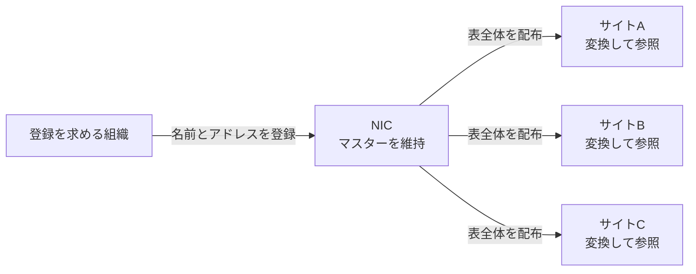
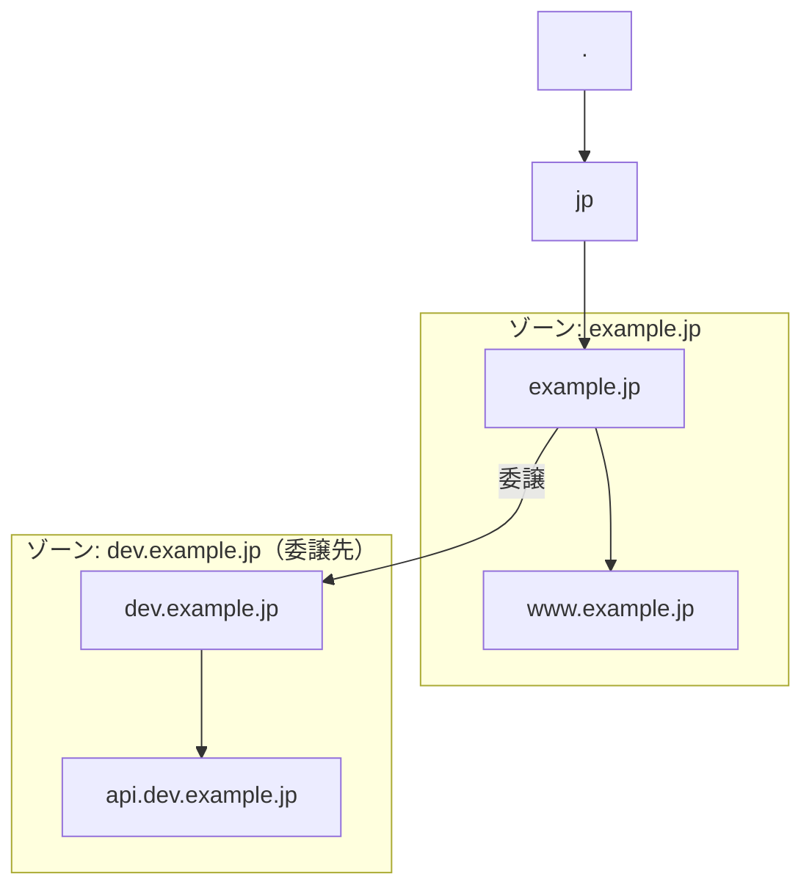

# 第2章 拡張性――集中管理を分割する

> この章は本文の初稿である。章全体の判定と改稿はまだ済んでいない。
>
> 年表と出来事の順序は第1章（見取り図）が担当する。この章では年表を再語りせず、集中管理がなぜ制約になり、委譲が責任をどう分割するのかという構造の分析に集中する。
>
> **この章は章構成の試作でもある。** 結論を冒頭へ置く形を試し、著者の判定が済んだ後に、第3章以降へ適用するかを決める。
>
> 構成の理由、扱わない範囲、見送った案は[この章の設計メモ](../docs/document-design/02-scalability.md)に記録する。

## 1. この章の結論

DNSは、名前の一意性を担保する責任と、データを更新する権限を、名前空間の部分木ごとに分割しました。中央がすべての登録を処理する代わりに、親ゾーンは子ゾーンへの委譲を示す情報を保持し、子ゾーンは自身の権威情報を保持します。ゾーンの境界は組織の境界と同じである必要はなく、同じ組織の中で分けることも、別の組織へ運用責任を渡すこともできます。これにより、個々の組織のデータ変更まで中央で処理せずに済みます。その代わり、委譲情報とゾーン境界を正しく保ち、委譲先の権威サーバーへ到達できるようにする必要が生じます。問題の切り分けも、単一の表を調べる形から、複数のゾーンと参照関係をたどる形へ変わります。

ただし、ここから「集中管理は悪く、分散管理は正しい」とは結論できません。この設計へ至るまでには、次の三段階がありました。

| 段 | 状態 | 何が問題だったか |
| --- | --- | --- |
| 第一段（1973年まで） | 不統一な分散。各サイトが自前のホスト表を手で維持 | どれも不完全で、互いに食い違っていた |
| 第二段（1974〜1980年代前半） | 集中。中央が一つの表を維持し、各ホストが取得 | 規模と更新主体の増加で、中央の調整が詰まった |
| 第三段（1983年以降） | 委譲による分散。階層化して責任を分ける | 依存関係と切り分けの複雑さが増えた |

最初の集中管理は、不完全な表を各サイトが別々に維持する状態への対処でした。その後、規模と更新主体が増えたことで、今度は中央で一つの表を管理する方法が制約になりました。同じ「名前の一意性を保ち、更新を利用者へ届ける」という問題に対して、条件の変化に応じて逆向きの設計が選ばれたのです。設計を評価するときは、集中か分散かという分類だけでなく、その選択が成立した規模、更新頻度、管理主体の数を確かめる必要があります。

## 2. 要件の定義と評価観点

この章でいう拡張性は、管理対象のデータや、それを扱う主体が増えても、特定の主体に集まる処理と調整待ちを際限なく増やさずに運用を続けられる性質です。単に「何件まで保存できるか」だけでは測りません。ホスト名とアドレスの件数が同じでも、変更を求める組織が一つの場合と千の場合では、必要な権限確認や組織間調整が異なるからです。

まず、登録や変更を受け付ける主体について、単位時間あたりの要求件数、要求を処理し終えるまでの待ち時間、停止時に滞留する変更の範囲を見ます。中央の担当者がすべての要求を確認する設計では、更新主体が増えるほど受付と調整が同じ場所へ集まります。保存容量を増やしても、この待ちは解消しません。

次に、データを利用者へ届ける工程について、配る一覧の大きさ、配布の頻度、取得する主体の数、各主体が変換と保存に使う帯域や処理量を見ます。変更が一件だけでも一覧全体を取り直すなら、変更量と配布量は一致しません。また、利用者ごとに取得時点が違えば、中央の表が更新済みでも古いコピーが残ります。

三つ目は、管理の自律性です。各組織が自らの範囲を変更するために中央の承認を待つ回数と、全体で名前の一意性を守るために必要な調整量を見ます。調整を分割できても、同じ名前を別々の主体が割り当てられるようになれば、名前空間としては成立しません。したがって、更新権限を分ける設計と、一意性を保つ設計を対にして評価します。

最後に、分割によって増える負担を見ます。委譲する境界の数、参照時にたどる関係、障害時に確認する管理主体、境界をまたぐ設定の不一致が評価対象です。中央の処理量が減っても、利用者が名前を参照できなくなったり、障害箇所を特定できなくなったりすれば、分割は成功とはいえません。

以降では、**データ量の増加**と**更新主体の増加**を区別します。前者は主に保存、帯域、処理の問題です。後者は権限、責任、組織間調整の問題です。この章の主眼は後者にありますが、両者が同じ集中した工程へ負荷をかけていた点も切り離しません。

## 3. 第一段――集中管理は何を解決したのか

集中した一覧が作られる前から、公式のホスト名一覧はありました。しかし、RFC 606は、それがネットワークから機械可読な形で取得できず、各サイトが自分のシステムやプログラムで使う表を手元で維持していたと記録しています。著者が確認できた四つのサイトでは、名前とアドレスの対応が少しずつ異なり、完全な表は一つもありませんでした。これは回顧ではなく、1973年12月の同時代の報告です。[RFC 606: Host Names On-line](https://www.rfc-editor.org/rfc/rfc606.html)

この状態では、管理作業が分散していても、正しさを保つ責任は分担されていません。各サイトが同じ範囲の表を重複して直し、どれを正しいコピーとみなすかも揃わないからです。RFC 608では、この問題への応答として、Network Information Center（NIC）が機械可読な一覧を生成するプログラムを用意し、週次または必要に応じて実行する案が示されました。ここでの集中は、重複作業と食い違いを減らし、一つの基準となる表を配るための設計でした。[RFC 608: Host Names On-Line](https://www.rfc-editor.org/rfc/rfc608.html)

## 4. 第二段――集中管理の仕組みと、それが詰まった理由

### 一つの表を使う四つの工程

ホスト表を使った仕組みを「中央管理」の一語でまとめると、何が制約になったのかを見失います。実際には、少なくとも四つの工程がありました。利用する前に名前とアドレスを**登録**し、NICが一つのマスターを**維持**し、各サイトが表を**取得**し、それぞれの環境で使える形式へ変換して**参照**します。

登録とマスターの維持は中央に集まりますが、問い合わせのたびに中央へ接続するわけではありません。取得済みのコピーは各サイトで参照できます。したがって、NICや配布サービスの停止は新規登録、変更、次の取得を妨げますが、取得済みの名前を使う処理がすべて即座に止まるとは限りません。管理上の単一障害点と、参照時の単一障害点は別です。

### 登録と更新主体

RFC 810のASSUMPTIONS第7項は、名前とアドレスを使い始める前にNICと交渉して登録することを前提にしています。連絡先には電子メールアドレスだけでなく電話番号も記載されています。同じ文書の第6項は、取得したホスト表を必要な形式へ変換する責任を利用者に置いています。登録は中央で調整し、利用環境への適合は各利用者が担う分業でした。[RFC 810: DoD Internet Host Table Specification](https://www.rfc-editor.org/rfc/rfc810.html)

この工程では、データの件数だけでなく、独立した更新主体の数が効きます。要求元が増えると、名前の重複を避け、使用前であることを確かめ、登録内容と責任主体を調整する仕事が中央へ集まるからです。これは一次資料にある工程から導く本書の分析であり、当時の作業時間を測った結果ではありません。確認したRFCには処理時間や衝突件数の数値がないため、負荷の大きさは定量化しません。

RFC 882は、従来の表について、その大きさ、とりわけ更新頻度が管理可能な限界に近づいていると述べました。ここでは表の容量だけでなく、変化を一つの表へ取り込む工程が問題にされています。[RFC 882: Domain Names—Concepts and Facilities](https://www.rfc-editor.org/rfc/rfc882.html)

### マスターの配布とローカルコピー

中央のマスターを直しただけでは、各サイトのコピーは変わりません。利用者は更新された表を取得し、自分の環境で使える形式へ変換する必要があります。取得する時点がサイトごとに違えば、同じ時点でも参照している内容は異なり得ます。中央での更新、一覧の配布、ローカルでの利用は、それぞれ別の完了時点を持つ工程です。

RFC 1034の2.1節は、ホスト数を *N* としたとき、ホスト表の大きさと配布先がともに *N* に比例するため、新版を配る総ネットワーク帯域は *N* の二乗に比例するという設計上の見積りを示しています。これは1987年の説明であり、当時の転送量を測った実測値ではありません。確認した同時代資料には、ホスト数、ファイルサイズ、転送量の具体値がないため、ここから実際の規模や増加率までは断定できません。[RFC 1034: Domain Names—Concepts and Facilities](https://www.rfc-editor.org/rfc/rfc1034.html#section-2.1)

集中方式の制約は、中央にデータがあることだけではありません。登録要求が中央を通ること、変更の大小にかかわらず一覧を取得すること、各利用者がコピーを更新することが組み合わさっていました。保存場所だけを分散しても、登録の調整が中央に残れば更新主体の増加には対応できません。反対に、登録権限だけを分けても、全員へ一覧全体を配り続ければ配布負荷は残ります。

## 5. 問題を要件へ読み替える

当時の資料は、現在の非機能要件を章立てして論じたものではありません。ここまで確認した工程を、本書の評価軸で読み替えると次のようになります。この表は資料に書かれた分類ではなく、本書による分析です。

| 問題 | 要件としての読み替え | 主に対応する設計 |
| --- | --- | --- |
| 中央への登録・調整の集中 | 拡張性、運用性、管理の自律性 | 階層的名前空間、委譲、ゾーン |
| 一覧全体の反復配布 | 配布効率、性能 | 分散した権威情報、問い合わせ、キャッシュ |
| 変更からローカル利用までの時間差 | 鮮度と負荷の制御 | Time to Live（TTL）、ゾーン転送 |
| 平坦な名前の一意性を中央で調整 | 一意性と分散管理の両立 | 階層名と委譲 |
| 中央の保守・配布機能への依存 | 可用性、障害耐性 | 複数の権威サーバー、複製 |
| 既存利用を残した移行 | 後方互換性、段階的移行 | 旧名に `.ARPA` を付ける措置、新旧ホスト表の並行提供 |

一つの問題に一つの仕組みが対応するわけではありません。たとえば、委譲は更新権限を分けますが、問い合わせの負荷を単独で解決するものではありません。問い合わせ結果を再利用するキャッシュや、同じゾーンの情報を複製する仕組みは、性能、整合性、可用性から別に評価する必要があります。本章では責任分割を中心に扱い、TTLとキャッシュは第3章、複製間の変更反映は第5章で詳しく扱います。

## 6. 第三段――階層化、ゾーン、委譲

### 一意性を部分木ごとに保つ

平坦な名前空間では、各名前が全体で一意でなければならないため、名前を割り当てるたびに全体との衝突を調整する必要があります。RFC 921は、単純な文字列として全体で一意だった名前から、各構成要素が一つ上の構成要素の下でだけ一意となる構造化された名前へ変更すると説明しています。たとえば `www.example.jp` の `www` は、名前空間全体で唯一である必要はなく、`example.jp` の直下で一意なら構いません。[RFC 921: Domain Name System Implementation Schedule—Revised](https://www.rfc-editor.org/rfc/rfc921.html)

階層化だけでは、更新権限は分かれません。DNSは、名前空間をゾーンに分け、親ゾーンに子ゾーンへの**委譲**を示す情報を置きます。親ゾーンは子ゾーンの全データを持つ代わりに、子ゾーンの権威サーバーを示すName Server（NS）リソースレコード集合（RRset）を管理します。子ゾーンは委ねられた範囲の権威情報を管理します。委譲によって別の組織へ運用責任を渡せますが、プロトコル上の境界はゾーンであり、同じ組織内でゾーンを分けることもできます。中央がすべての末端データを更新する必要をなくしながら、親から子へたどれる関係を残す設計です。[RFC 1034: Domain Names—Concepts and Facilities](https://www.rfc-editor.org/rfc/rfc1034.html) 2.4節、4.2節

### ドメインとゾーンは同じ境界ではない

RFC 1034の3.1節では、**ドメイン**は名前空間中のあるノードを根とする部分木と定義されています。これに対し、RFC 9499の現行用語でいう**ゾーン**は、ある権威サーバー群が同じ権威情報を提供する範囲です。部分木の途中を子へ委譲すると、委譲先の部分木は元のドメインに含まれたままでも、親のゾーンには含まれません。[RFC 1034: Domain Names—Concepts and Facilities](https://www.rfc-editor.org/rfc/rfc1034.html#section-3.1)、[RFC 9499: DNS Terminology](https://www.rfc-editor.org/rfc/rfc9499.html) 2節、7節

次の図では、名前空間上は `dev.example.jp` も `example.jp` ドメインの一部です。しかし、`dev.example.jp` には委譲があるため、二つは別のゾーンです。親ゾーンは子ゾーンの `api` の値を管理せず、子ゾーンへの委譲を示すNS RRsetを管理します。

この区別によって、一意性を保つ責任にも境界ができます。親ゾーンは子ゾーンへの委譲を表すNS RRsetを管理し、子ゾーンではその範囲の名前を割り当てます。一つのNS RRsetには複数の権威サーバーを指定できるため、委譲を「一つの名前と一つの管理主体との対応」とみなすことはできません。全体の一意性を捨てたのではなく、名前を割り当てる範囲をゾーン境界に沿って分割したのです。[RFC 1034: Domain Names—Concepts and Facilities](https://www.rfc-editor.org/rfc/rfc1034.html#section-4.2.1)

### 一括配布から必要な情報の参照へ

委譲されたデータは一つの表に集め直されません。反復解決を行うリゾルバは、親が示す委譲情報をたどり、必要な名前の権威情報を持つサーバーへ問い合わせます。端末上のスタブリゾルバは、通常、この処理を再帰リゾルバへ依頼します。これにより、ある組織の変更を、名前空間全体の利用者へ一覧として配る必要はなくなります。ただし、問い合わせ経路とキャッシュの詳しい動作は性能を担当する第3章で扱います。ここで重要なのは、データの所在だけでなく、データを見つけるための参照関係も分散したことです。[RFC 1034: Domain Names—Concepts and Facilities](https://www.rfc-editor.org/rfc/rfc1034.html) 5.3.1節、5.3.3節

## 7. 得られた効果と引き受けた代償

### 中央の仕事をなくすのではなく限定する

委譲後も、ルートや親ゾーンの管理は必要です。変わるのは中央の有無ではなく、中央が扱う範囲です。親側は子の委譲と到達方法を保ち、子側の個々のホスト名やアドレスまでは更新しません。子側は委譲された範囲を自律的に変更できます。その結果、末端の更新主体が増えても、すべての変更要求が一つの担当者へ集まる構造を避けられます。

利用者への配布も変わります。一覧全体を全利用者へ反復して送る代わりに、必要な権威情報を問い合わせ、得た結果をキャッシュして再利用できます。これは配布量を減らす一方で、キャッシュされたコピーと権威データの間に時間差を生みます。拡張性を得た結果として、性能と整合性の調整が必要になったのです。

### 境界と依存関係が増える

責任を分けるには、親子双方の設定が合っていなければなりません。親側が示す委譲先、子側が提供するゾーン、権威サーバーへの到達性のいずれかが欠けると、その範囲を参照できなくなります。分散していること自体は障害耐性を保証しません。複数の権威サーバーや複製をどう配置するかは、第4章で可用性の要件から評価します。

障害調査の対象も増えます。平坦な表なら、中央のマスターと手元のコピーを比べることが中心でした。委譲後は、親の委譲情報、子の権威情報、問い合わせ経路、途中に残るキャッシュを区別する必要があります。管理主体を分ける設計は、障害の影響範囲を局所化できる反面、どの境界で失敗したかを観測する負担を増やします。

### 稼働中の仕組みを段階的に移す

新しい設計が優れていても、既存の名前を一度に無効にはできません。RFC 921が示した移行の第一段では、旧来の名前へ `.ARPA` を付けたものをドメイン形式の名前としました。既存の名前を新しい階層の中へ機械的に写すことで、最初からすべてを命名し直す事態を避けています。

ホスト表も直ちに廃止せず、新形式をDHOSTS.TXTとして並行提供した後、それをHOSTS.TXTへ切り替え、旧版をOHOSTS.TXTとして残す計画でした。同じ文書は、前身のRFC 881で定めた予定が機能しなかったことも記録しています。ここで確認できるのは、責任を分割する設計と、その設計へ既存利用を移す手順が別の問題だったことです。移行予定が守られなかった理由と、段階的導入の評価は第9章で扱います。[RFC 921: Domain Name System Implementation Schedule—Revised](https://www.rfc-editor.org/rfc/rfc921.html)

## 8. 運用上の注意と他システムへの応用

責任を分割するときは、データだけを分けて終わりにできません。各範囲を変更できる主体、上位からその範囲を見つける方法、境界をまたぐ設定の確認方法、障害時の連絡先を一緒に決める必要があります。DNSで親の委譲と子のゾーンが対になるように、一般のシステムでも、仕事を渡す側と受け取る側の契約を両側から検証できる形にします。

階層化が適するのは、全体で守る一意性を部分ごとの規則へ分解でき、それぞれに継続的な責任主体を置ける場合です。テナントごとの設定、組織単位のアクセス権、地域ごとのデータ所有などは同じ形を取り得ます。一方、変更のたびに多数の境界を横断するデータや、責任範囲が頻繁に組み替わる仕事では、委譲後も調整コストが残ります。木構造にできない依存関係を無理に階層へ押し込むと、境界をまたぐ例外が増えます。

集中管理を選ぶ条件も残ります。主体が少なく、更新がまれで、一覧を小さく保てるなら、一つの基準を中央で維持するほうが食い違いを防ぎやすく、責任の所在も明確です。第一段の失敗は「分散していたこと」ではなく、各主体が同じ範囲の不完全なコピーを別々に維持していたことでした。分散を選ぶ前に、中央の保存容量ではなく、更新を待つ時間、主体間の調整量、一括配布の負荷が実際に制約になっているかを確かめるべきです。

分割後の評価では、局所的な処理量だけを見ません。参照経路の長さ、共通の依存先、境界の設定不一致、障害の影響範囲、切り分けに必要な観測点を数えます。中央のボトルネックを複数の境界問題へ置き換えただけなら、得た効果と新しい代償を説明できません。拡張性の設計とは、単に台数や管理者を増やすことではなく、増える仕事と、それを調整する責任を同じ境界で分けることです。

## この章の言い換え

| 前 | 後 |
| --- | --- |
| 「DNSは分散しているから拡張性が高い」 | 「一意性を保つ責任と更新権限を部分木ごとに分け、末端の変更を一つの担当者へ集めない」 |
| 「昔は中央管理だったから駄目だった」 | 「主体が少ない間は一つの一覧が食い違いを減らし、主体と更新が増えると受付と配布が制約になる」 |
| 「ドメインとゾーンは同じ範囲だ」 | 「ドメインは名前空間の部分木であり、委譲された部分木は親ドメインに含まれても親ゾーンには含まれない」 |

## 参照資料

- [RFC 606: Host Names On-line](https://www.rfc-editor.org/rfc/rfc606.html)
- [RFC 608: Host Names On-Line](https://www.rfc-editor.org/rfc/rfc608.html)
- [RFC 810: DoD Internet Host Table Specification](https://www.rfc-editor.org/rfc/rfc810.html) ASSUMPTIONS第6項・第7項
- [RFC 882: Domain Names—Concepts and Facilities](https://www.rfc-editor.org/rfc/rfc882.html)
- [RFC 921: Domain Name System Implementation Schedule—Revised](https://www.rfc-editor.org/rfc/rfc921.html)
- [RFC 1034: Domain Names—Concepts and Facilities](https://www.rfc-editor.org/rfc/rfc1034.html) 2.1節、2.4節、3.1節、4.2節、5.3.1節、5.3.3節
- [RFC 9499: DNS Terminology](https://www.rfc-editor.org/rfc/rfc9499.html) 2節、7節

---

[← 準備章 なぜ名前解決が必要なのか](01-name-resolution.md)｜[目次](../)｜[次の章 性能 →](../docs/outline.md#第3章-性能問い合わせ経路と再利用を設計する)


