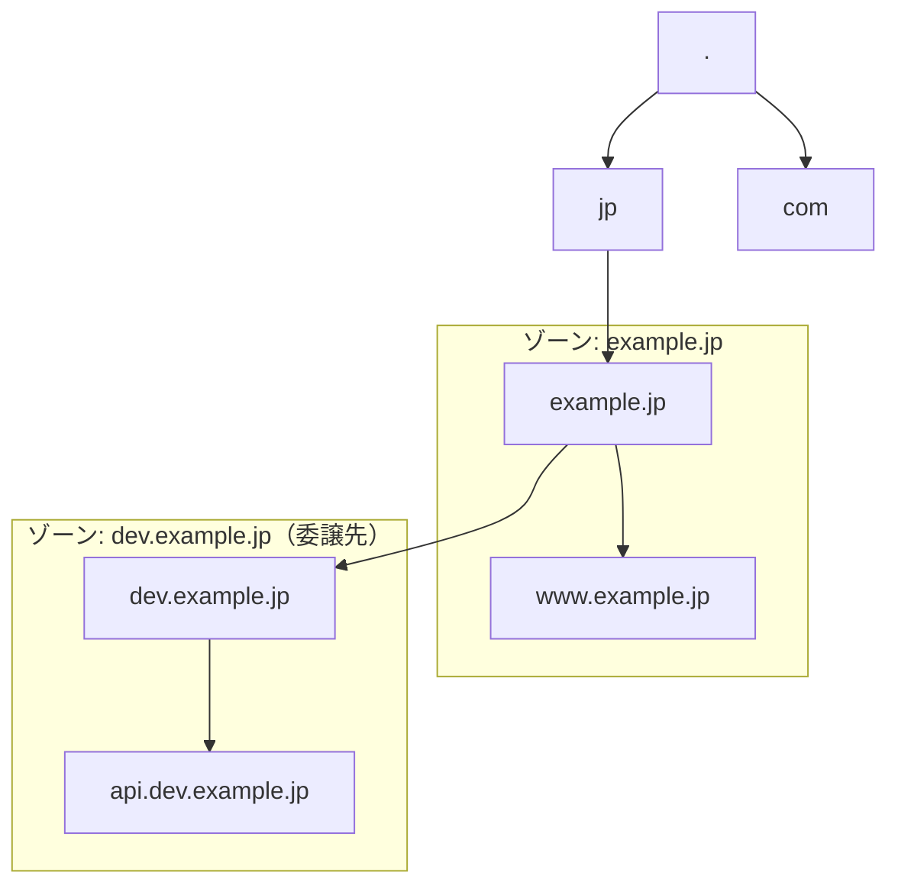
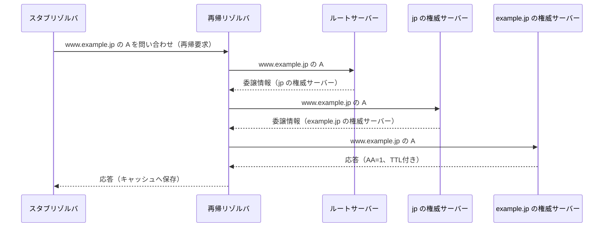
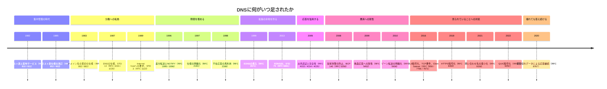

# 図の下書き

このページは本書の本文ではない。第2章、第3章、第5章で使う図の下書きを置く作業用ページである。各章が図を取り込んだら、対応する節を削除する。全章完成時に空になっていることを #19 の通し確認で確かめる。

## 図示方式（2026-08-04 に決定）

| 用途 | 方式 |
| --- | --- |
| 階層構造、委譲、問い合わせ経路、ゾーン境界 | mermaid のコードフェンス |
| 時間軸（TTL満了、変更反映の時間差、複製の伝播） | 手書きのインラインSVG |

Pages上で3種類とも意図通り描画されることを目視確認した。ゾーン境界は当初手書きSVGが必要かと考えたが、mermaid の `subgraph` で足りると判断した。

検証で分かった実装上の事実を残す。

- Liquid はフロントマターのない `.md` でも展開されるため、`_layouts/default.html` の上書きは不要。`` を図のあるページの末尾へ置けばよい。
- kramdown は ` ```mermaid ` を `<pre><code class="language-mermaid">` として出力し、mermaid はこの形を認識しない。`_includes/mermaid.html` で `.mermaid` の div へ置き換えてから初期化している。
- `mermaid@11` の `dist/mermaid.min.js` は末尾で `globalThis["mermaid"]` へ代入するため、グローバル参照で初期化できる。冒頭が `__esbuild_esm_mermaid_nm` で始まるので一見ESM形式に見えるが、UMDとして使える。
- 手書きのインラインSVGはkramdownをそのまま通過する。

## 1. 階層的名前空間と委譲（mermaid: graph）

第2章で使う想定の図。名前空間の階層と、ゾーンの境界が名前空間の部分木と一致しない場合を示す。



## 2. 反復問い合わせの経路（mermaid: sequenceDiagram）

第3章で使う想定の図。再帰リゾルバが権威サーバーへ反復問い合わせを行う往復を示す。



## 4. 年表（mermaid: timeline）

第1章で使う想定の図。`timeline` は `graph` や `sequenceDiagram` とは別の図種で、**Pages上での描画は未検証**。崩れる場合は手書きSVGへ切り替える。

節の開始年は昇順に並べているが、節の期間は重なる。標準化が並行して走るためであり、束の中では厳密な年代順を主張しない。



## 3. TTLと変更反映の時間差（インラインSVG）

第5章で使う想定の図。mermaidでは時間軸の図が書きにくいため、手書きSVGで試す。権威データの変更が、TTLの残っているキャッシュには即座に反映されないことを示す。

<svg viewBox="0 0 640 200" width="100%" role="img" aria-label="TTLの残存によって権威の変更がキャッシュへ反映されない期間を示す時間軸の図">
  <line x1="60" y1="60" x2="600" y2="60" stroke="#57606a" stroke-width="1.5"/>
  <line x1="60" y1="130" x2="600" y2="130" stroke="#57606a" stroke-width="1.5"/>
  <text x="60" y="45" font-size="13" fill="#24292f">権威データ</text>
  <text x="60" y="115" font-size="13" fill="#24292f">リゾルバのキャッシュ</text>

  <rect x="60" y="50" width="180" height="20" fill="#dafbe1" stroke="#57606a" stroke-width="1"/>
  <text x="150" y="65" font-size="12" text-anchor="middle" fill="#24292f">旧値</text>
  <rect x="240" y="50" width="360" height="20" fill="#ddf4ff" stroke="#57606a" stroke-width="1"/>
  <text x="420" y="65" font-size="12" text-anchor="middle" fill="#24292f">新値</text>

  <rect x="120" y="120" width="240" height="20" fill="#dafbe1" stroke="#57606a" stroke-width="1"/>
  <text x="240" y="135" font-size="12" text-anchor="middle" fill="#24292f">旧値（TTLが残っている）</text>
  <rect x="360" y="120" width="240" height="20" fill="#ddf4ff" stroke="#57606a" stroke-width="1"/>
  <text x="480" y="135" font-size="12" text-anchor="middle" fill="#24292f">新値</text>

  <line x1="240" y1="40" x2="240" y2="160" stroke="#cf222e" stroke-width="1.5" stroke-dasharray="4 3"/>
  <text x="244" y="180" font-size="12" fill="#cf222e">権威を変更</text>
  <line x1="360" y1="40" x2="360" y2="160" stroke="#8250df" stroke-width="1.5" stroke-dasharray="4 3"/>
  <text x="364" y="180" font-size="12" fill="#8250df">TTL満了</text>

  <line x1="240" y1="100" x2="360" y2="100" stroke="#24292f" stroke-width="1" marker-end="url(#arrow)"/>
  <text x="300" y="95" font-size="12" text-anchor="middle" fill="#24292f">反映されない期間</text>
  <defs>
    <marker id="arrow" viewBox="0 0 10 10" refX="9" refY="5" markerWidth="6" markerHeight="6" orient="auto">
      <path d="M 0 0 L 10 5 L 0 10 z" fill="#24292f"/>
    </marker>
  </defs>
</svg>


