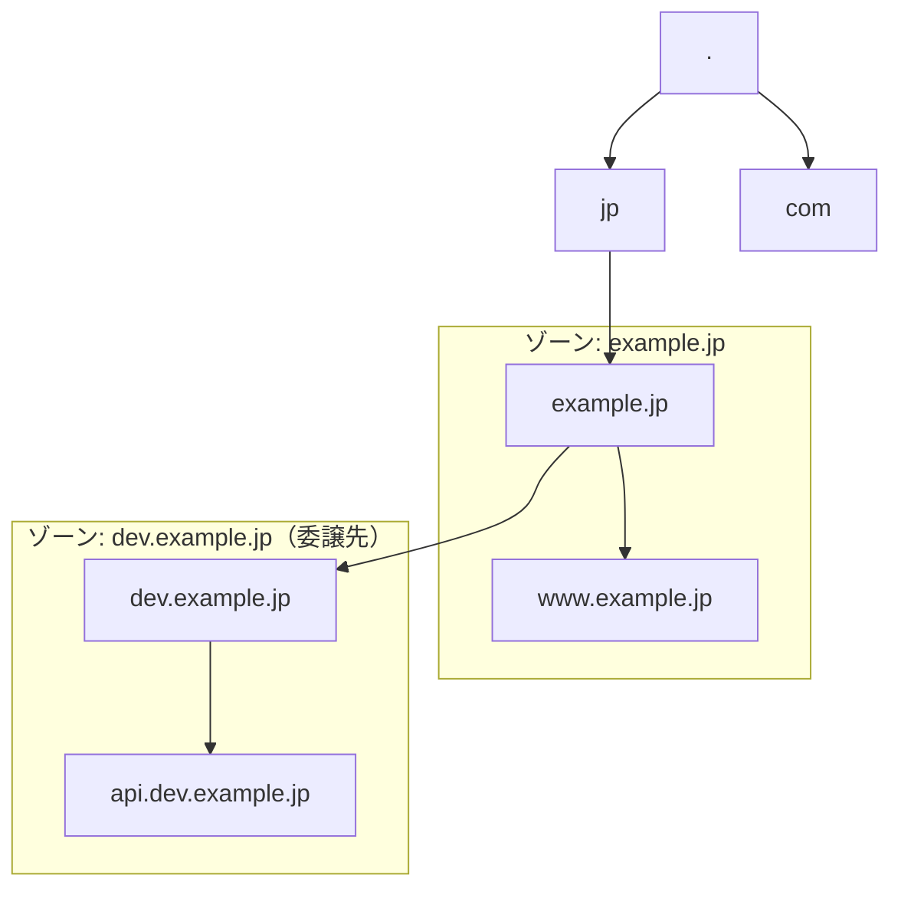
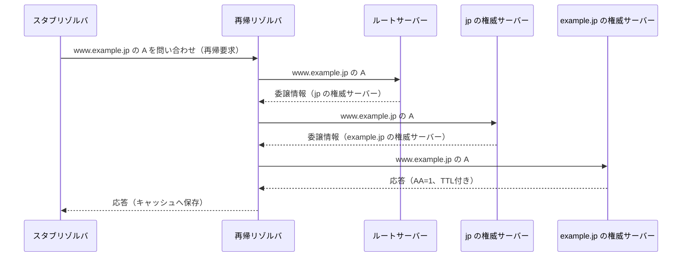

# 図の下書き

このページは本書の本文ではない。第2章、第3章、第5章で使う図の下書きを置く作業用ページである。各章が図を取り込んだら、対応する節を削除する。全章完成時に空になっていることを #19 の通し確認で確かめる。

## 図示方式（2026-08-04 に決定）

| 用途 | 方式 |
| --- | --- |
| 階層構造、委譲、問い合わせ経路、ゾーン境界 | mermaid のコードフェンス |
| 時間軸（TTL満了、変更反映の時間差、複製の伝播、年表） | 手書きのインラインSVG。項目数が多い場合は縦に並べる |

Pages上で3種類とも意図通り描画されることを目視確認した。ゾーン境界は当初手書きSVGが必要かと考えたが、mermaid の `subgraph` で足りると判断した。

検証で分かった実装上の事実を残す。

- Liquid はフロントマターのない `.md` でも展開されるため、`_layouts/default.html` の上書きは不要。`` を図のあるページの末尾へ置けばよい。
- kramdown は ` ```mermaid ` を `<pre><code class="language-mermaid">` として出力し、mermaid はこの形を認識しない。`_includes/mermaid.html` で `.mermaid` の div へ置き換えてから初期化している。
- `mermaid@11` の `dist/mermaid.min.js` は末尾で `globalThis["mermaid"]` へ代入するため、グローバル参照で初期化できる。冒頭が `__esbuild_esm_mermaid_nm` で始まるので一見ESM形式に見えるが、UMDとして使える。
- 手書きのインラインSVGはkramdownをそのまま通過する。
- mermaid の `timeline` は使わない（2026-08-05に確認）。横方向に項目を並べる図種のため、18項目では自然幅が本文幅を超え、`max-width` による縮小で文字が読めなくなる。フォント設定では直らない。同じ失敗を繰り返さないために記録する。

## 1. 階層的名前空間と委譲（mermaid: graph）

第2章で使う想定の図。名前空間の階層と、ゾーンの境界が名前空間の部分木と一致しない場合を示す。



## 2. 反復問い合わせの経路（mermaid: sequenceDiagram）

第3章で使う想定の図。再帰リゾルバが権威サーバーへ反復問い合わせを行う往復を示す。



## 4. 年表（手書きの縦SVG）

第1章で使う想定の図。**mermaid の `timeline` は使わない。** 横方向に18項目を並べると図の自然幅が本文幅を大きく超え、`max-width` で縮小されて文字が読めなくなる。設定では直らない。

年表は時間軸を持つ図であり、`style-guide.md` が定めた通り手書きのインラインSVGを使う。縦にする理由は、Webページでは幅が希少で高さが自由なため。縦なら縮小がかからず文字サイズを固定できる。

時代の見出しは開始年の昇順に並べているが、時代の期間は重なる。標準化が並行して走るためであり、束の中では厳密な年代順を主張しない。

<svg viewBox="0 0 680 1092" width="100%" role="img" aria-label="DNSに何がいつ足されたかを時代ごとに縦方向に並べた年表">
  <line x1="104" y1="72" x2="104" y2="1048" stroke="#d0d7de" stroke-width="2"/>
  <text x="0" y="46" font-size="13" font-weight="bold" fill="#0969da">集中管理の時代</text>
  <line x1="0" y1="54" x2="680" y2="54" stroke="#0969da" stroke-width="1" opacity="0.25"/>
  <text x="86" y="78" font-size="13" font-weight="bold" fill="#57606a" text-anchor="end">1973</text>
  <circle cx="104" cy="74" r="4" fill="#0969da"/>
  <text x="120" y="78" font-size="13" fill="#24292f">各サイトが自前のホスト表を維持していた（RFC 606）</text>
  <text x="86" y="110" font-size="13" font-weight="bold" fill="#57606a" text-anchor="end">1974</text>
  <circle cx="104" cy="106" r="4" fill="#0969da"/>
  <text x="120" y="110" font-size="13" fill="#24292f">NICが機械可読の一覧を生成する体制へ（RFC 608）</text>
  <text x="86" y="142" font-size="13" font-weight="bold" fill="#57606a" text-anchor="end">1982</text>
  <circle cx="104" cy="138" r="4" fill="#0969da"/>
  <text x="120" y="142" font-size="13" fill="#24292f">ホスト表と、その配布サービス（RFC 810 / 811）</text>
  <text x="86" y="174" font-size="13" font-weight="bold" fill="#57606a" text-anchor="end">1985</text>
  <circle cx="104" cy="170" r="4" fill="#0969da"/>
  <text x="120" y="174" font-size="13" fill="#24292f">ホスト表仕様の改訂（RFC 952 / 953）</text>
  <text x="0" y="216" font-size="13" font-weight="bold" fill="#0969da">分散への転換</text>
  <line x1="0" y1="224" x2="680" y2="224" stroke="#0969da" stroke-width="1" opacity="0.25"/>
  <text x="86" y="248" font-size="13" font-weight="bold" fill="#57606a" text-anchor="end">1983</text>
  <circle cx="104" cy="244" r="4" fill="#0969da"/>
  <text x="120" y="248" font-size="13" fill="#24292f">ドメイン名の最初の仕様（RFC 882 / 883）</text>
  <text x="86" y="280" font-size="13" font-weight="bold" fill="#57606a" text-anchor="end">1984</text>
  <circle cx="104" cy="276" r="4" fill="#0969da"/>
  <text x="120" y="280" font-size="13" fill="#24292f">ドメイン名への移行スケジュール（RFC 921）</text>
  <text x="86" y="312" font-size="13" font-weight="bold" fill="#57606a" text-anchor="end">1987</text>
  <circle cx="104" cy="308" r="4" fill="#0969da"/>
  <text x="120" y="312" font-size="13" fill="#24292f">DNSの仕様、STD 13（RFC 1034 / 1035）</text>
  <text x="86" y="344" font-size="13" font-weight="bold" fill="#57606a" text-anchor="end">1989</text>
  <circle cx="104" cy="340" r="4" fill="#0969da"/>
  <text x="120" y="344" font-size="13" fill="#24292f">Internet hostへの要求、STD 3（RFC 1123）</text>
  <text x="0" y="386" font-size="13" font-weight="bold" fill="#0969da">隙間を埋める</text>
  <line x1="0" y1="394" x2="680" y2="394" stroke="#0969da" stroke-width="1" opacity="0.25"/>
  <text x="86" y="418" font-size="13" font-weight="bold" fill="#57606a" text-anchor="end">1996</text>
  <circle cx="104" cy="414" r="4" fill="#0969da"/>
  <text x="120" y="418" font-size="13" fill="#24292f">変更通知と差分転送（RFC 1996 / 1995）</text>
  <text x="86" y="450" font-size="13" font-weight="bold" fill="#57606a" text-anchor="end">1997</text>
  <circle cx="104" cy="446" r="4" fill="#0969da"/>
  <text x="120" y="450" font-size="13" fill="#24292f">仕様の明確化（RFC 2181）</text>
  <text x="86" y="482" font-size="13" font-weight="bold" fill="#57606a" text-anchor="end">1998</text>
  <circle cx="104" cy="478" r="4" fill="#0969da"/>
  <text x="120" y="482" font-size="13" fill="#24292f">不在応答の再利用（RFC 2308）</text>
  <text x="0" y="524" font-size="13" font-weight="bold" fill="#0969da">拡張の余地を作る</text>
  <line x1="0" y1="532" x2="680" y2="532" stroke="#0969da" stroke-width="1" opacity="0.25"/>
  <text x="86" y="556" font-size="13" font-weight="bold" fill="#57606a" text-anchor="end">1999</text>
  <circle cx="104" cy="552" r="4" fill="#0969da"/>
  <text x="120" y="556" font-size="13" fill="#24292f">EDNSの導入（RFC 2671）</text>
  <text x="86" y="588" font-size="13" font-weight="bold" fill="#57606a" text-anchor="end">2013</text>
  <circle cx="104" cy="584" r="4" fill="#0969da"/>
  <text x="120" y="588" font-size="13" fill="#24292f">EDNS(0)、STD 75（RFC 6891）</text>
  <text x="0" y="630" font-size="13" font-weight="bold" fill="#0969da">応答を信用する</text>
  <line x1="0" y1="638" x2="680" y2="638" stroke="#0969da" stroke-width="1" opacity="0.25"/>
  <text x="86" y="662" font-size="13" font-weight="bold" fill="#57606a" text-anchor="end">2005</text>
  <circle cx="104" cy="658" r="4" fill="#0969da"/>
  <text x="120" y="662" font-size="13" fill="#24292f">出所認証と完全性（RFC 4033 / 4034 / 4035）</text>
  <text x="0" y="704" font-size="13" font-weight="bold" fill="#0969da">悪用への耐性</text>
  <line x1="0" y1="712" x2="680" y2="712" stroke="#0969da" stroke-width="1" opacity="0.25"/>
  <text x="86" y="736" font-size="13" font-weight="bold" fill="#57606a" text-anchor="end">2008</text>
  <circle cx="104" cy="732" r="4" fill="#0969da"/>
  <text x="120" y="736" font-size="13" fill="#24292f">反射攻撃の防止、BCP 140（RFC 5358）</text>
  <text x="86" y="768" font-size="13" font-weight="bold" fill="#57606a" text-anchor="end">2009</text>
  <circle cx="104" cy="764" r="4" fill="#0969da"/>
  <text x="120" y="768" font-size="13" fill="#24292f">偽造応答への耐性（RFC 5452）</text>
  <text x="86" y="800" font-size="13" font-weight="bold" fill="#57606a" text-anchor="end">2010</text>
  <circle cx="104" cy="796" r="4" fill="#0969da"/>
  <text x="120" y="800" font-size="13" fill="#24292f">ゾーン転送の明確化（RFC 5936）</text>
  <text x="0" y="842" font-size="13" font-weight="bold" fill="#0969da">見られていることへの対処</text>
  <line x1="0" y1="850" x2="680" y2="850" stroke="#0969da" stroke-width="1" opacity="0.25"/>
  <text x="86" y="874" font-size="13" font-weight="bold" fill="#57606a" text-anchor="end">2016</text>
  <circle cx="104" cy="870" r="4" fill="#0969da"/>
  <text x="120" y="874" font-size="13" fill="#24292f">TLS暗号化、TCP要件、Client Subnet（RFC 7858 / 7766 / 7871）</text>
  <text x="86" y="906" font-size="13" font-weight="bold" fill="#57606a" text-anchor="end">2018</text>
  <circle cx="104" cy="902" r="4" fill="#0969da"/>
  <text x="120" y="906" font-size="13" fill="#24292f">HTTPS暗号化（RFC 8484）</text>
  <text x="86" y="938" font-size="13" font-weight="bold" fill="#57606a" text-anchor="end">2021</text>
  <circle cx="104" cy="934" r="4" fill="#0969da"/>
  <text x="120" y="938" font-size="13" fill="#24292f">問い合わせ名の最小化（RFC 9156）</text>
  <text x="86" y="970" font-size="13" font-weight="bold" fill="#57606a" text-anchor="end">2022</text>
  <circle cx="104" cy="966" r="4" fill="#0969da"/>
  <text x="120" y="970" font-size="13" fill="#24292f">QUIC暗号化（RFC 9250）</text>
  <text x="0" y="1012" font-size="13" font-weight="bold" fill="#0969da">壊れても答え続ける</text>
  <line x1="0" y1="1020" x2="680" y2="1020" stroke="#0969da" stroke-width="1" opacity="0.25"/>
  <text x="86" y="1044" font-size="13" font-weight="bold" fill="#57606a" text-anchor="end">2020</text>
  <circle cx="104" cy="1040" r="4" fill="#0969da"/>
  <text x="120" y="1044" font-size="13" fill="#24292f">期限切れデータによる応答継続（RFC 8767）</text>
</svg>

## 3. TTLと変更反映の時間差（インラインSVG）

第5章で使う想定の図。mermaidでは時間軸の図が書きにくいため、手書きSVGで試す。権威データの変更が、TTLの残っているキャッシュには即座に反映されないことを示す。

<svg viewBox="0 0 640 200" width="100%" role="img" aria-label="TTLの残存によって権威の変更がキャッシュへ反映されない期間を示す時間軸の図">
  <line x1="60" y1="60" x2="600" y2="60" stroke="#57606a" stroke-width="1.5"/>
  <line x1="60" y1="130" x2="600" y2="130" stroke="#57606a" stroke-width="1.5"/>
  <text x="60" y="45" font-size="13" fill="#24292f">権威データ</text>
  <text x="60" y="115" font-size="13" fill="#24292f">リゾルバのキャッシュ</text>

  <rect x="60" y="50" width="180" height="20" fill="#dafbe1" stroke="#57606a" stroke-width="1"/>
  <text x="150" y="65" font-size="12" text-anchor="middle" fill="#24292f">旧値</text>
  <rect x="240" y="50" width="360" height="20" fill="#ddf4ff" stroke="#57606a" stroke-width="1"/>
  <text x="420" y="65" font-size="12" text-anchor="middle" fill="#24292f">新値</text>

  <rect x="120" y="120" width="240" height="20" fill="#dafbe1" stroke="#57606a" stroke-width="1"/>
  <text x="240" y="135" font-size="12" text-anchor="middle" fill="#24292f">旧値（TTLが残っている）</text>
  <rect x="360" y="120" width="240" height="20" fill="#ddf4ff" stroke="#57606a" stroke-width="1"/>
  <text x="480" y="135" font-size="12" text-anchor="middle" fill="#24292f">新値</text>

  <line x1="240" y1="40" x2="240" y2="160" stroke="#cf222e" stroke-width="1.5" stroke-dasharray="4 3"/>
  <text x="244" y="180" font-size="12" fill="#cf222e">権威を変更</text>
  <line x1="360" y1="40" x2="360" y2="160" stroke="#8250df" stroke-width="1.5" stroke-dasharray="4 3"/>
  <text x="364" y="180" font-size="12" fill="#8250df">TTL満了</text>

  <line x1="240" y1="100" x2="360" y2="100" stroke="#24292f" stroke-width="1" marker-end="url(#arrow)"/>
  <text x="300" y="95" font-size="12" text-anchor="middle" fill="#24292f">反映されない期間</text>
  <defs>
    <marker id="arrow" viewBox="0 0 10 10" refX="9" refY="5" markerWidth="6" markerHeight="6" orient="auto">
      <path d="M 0 0 L 10 5 L 0 10 z" fill="#24292f"/>
    </marker>
  </defs>
</svg>


